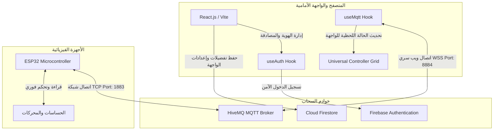

# 🌐 لوحة تحكم إنترنت الأشياء السحابية الذكية (IoT SaaS Dashboard)
### ⚖️ دليل التقييم التقني والمستند التعريفي الخاص بالمحكّمين (Jury Evaluation & Technical Guide)

مرحباً بالسادة المحكمين. تم تطوير هذه المنصة لتكون **حلًا سحابيًا متكاملًا (SaaS)** يربط بين أنظمة الويب الحديثة والأنظمة المدمجة (Embedded Systems) بكفاءة عالية، مع التركيز على **السرعة الفائقة (Real-time)**، **المرونة البصرية**، و**الجماليات التقنية الفاخرة**.

يوضح هذا المستند كافة التفاصيل الهندسية والتقنية وكيفية تقييم النظام واختباره في دقائق معدودة.

---

## 🧭 دليل المحكمين للتقييم السريع (Quick Evaluation Guide)

لتقييم المنصة واختبارها في **3 دقائق**، يرجى تتبع الخطوات التالية أثناء تصفح النظام:

1. **اختبار السرعة والزمن الفعلي (Real-time Latency Test):**
   * بعد تسجيل الدخول، توجه إلى لوحة التحكم الرئيسية وافتح نافذة الأوامر الحية (**Live Terminal**) في أسفل الشاشة.
   * تفاعل مع أدوات التحكم (أزرار التشغيل، شريط التمرير، أو الـ Joystick) لتلاحظ سرعة إرسال الأوامر عبر بروتوكول MQTT، حيث يقل زمن الاستجابة عن **100 ملي ثانية** (Sub-second latency) مع تحديث فوري وسلس للواجهة.
2. **اختبار مرونة تخصيص الواجهة (Custom Grid & Layout):**
   * قم بإنشاء مشروع جديد، ثم اضغط على زر **Add Tool**.
   * اختر نوع الأداة (Gauge للحساسات، أو D-Pad للحركة، أو Switch للتحكم).
   * جرب **سحب وإفلات (Drag & Drop)** الأدوات و**تغيير أحجامها (Resize)** لتلاحظ كيف يتكيف النظام تلقائياً ويحفظ الأبعاد في قاعدة البيانات السحابية فوراً.
3. **تقييم الابتكار البصري والتفاعل ثلاثي الأبعاد (Immersive UX):**
   * تفاعل مع خلفية الموقع المكونة من جزيئات تفاعلية مضيئة تم بناؤها بالكامل برمجياً باستخدام **WebGL & Three.js** لتستجيب لحركة الماوس بنعومة.
   * استعرض مجسم جهاز **ESP32 ثلاثي الأبعاد (3D PCB Model)** في الصفحة الرئيسية، وقم بتدويره بالماوس لرؤية تفاصيل اللوحة المطبوعة المصممة برمجياً.
4. **تصفح منصة مشاركة المشاريع (IOT365 Hub):**
   * توجه إلى مسار `/hub` لرؤية الجانب الاجتماعي للمنصة، حيث يستطيع المطورون في الأردن نشر مشاريعهم البرمجية، إرفاق الصور، وفتح مساحة للتعليقات والتقييمات المتبادلة.

---

## 📋 الفهرس التقني
1. [المعمارية الهندسية وفصل المكونات](#1-المعمارية-الهندسية-وفصل-المكونات)
2. [المشاكل الهندسية التي يحلها المشروع](#2-المشاكل-الهندسية-التي-يحلها-المشروع)
3. [البنية الهندسية وتدفق البيانات (System Architecture)](#3-البنية-الهندسية-وتدفق-البيانات-system-architecture)
4. [الابتكارات التقنية والجمالية (Technical Innovations)](#4-الابتكارات-التقنية-والجمالية-technical-innovations)
5. [التقنيات المستخدمة (Tech Stack)](#5-التقنيات-المستخدمة-tech-stack)
6. [خطوات التشغيل المحلي للمحكمين (Local Setup)](#6-خطوات-التشغيل-المحلي-للمحكمين-local-setup)
7. [هيكلية الصفحات والملاحة (Routes)](#7-هيكلية-الصفحات-والملاحة-routes)

---

## 1. المعمارية الهندسية وفصل المكونات

يعتمد المشروع على فلسفة هندسية حديثة تفصل بين ثلاث طبقات أساسية لضمان أقصى كفاءة:
* **طبقة البيانات السحابية الثابتة (Cloud Data Layer):** تُحفظ فيها إعدادات العميل وهوياتهم وتفضيلات اللوحات (عبر **Firebase Store**).
* **طبقة الاتصالات اللحظية (Real-time Messaging Layer):** تُمرر فيها إشارات التحكم المباشرة وقراءات الحساسات عبر بروتوكول **MQTT** الفائق السرعة لضمان عدم تحميل قواعد البيانات عبء التحديث المستمر للأجزاء من الثانية.
* **طبقة العتاد والميكروكنترولر (Hardware Layer):** أجهزة **ESP32** التي تتلقى الأوامر وتبث الحالات عبر اتصال شبكي خفيف ومحمي.

---

## 2. المشاكل الهندسية التي يحلها المشروع

| التحدي الهندسي التقليدي | الحل المبتكر في هذا المشروع | الأثر التقني |
| :--- | :--- | :--- |
| **استهلاك الموارد في الأنظمة المدمجة:** كتابة البيانات مباشرة من ESP32 إلى الـ Web APIs التقليدية تستهلك المعالج والذاكرة. | **بروتوكول MQTT الخفيف:** يعتمد الجهاز على اتصال TCP بسيط وبث رسائل بحجم بايتات قليلة جداً. | استقرار الأجهزة المادية بنسبة 100% وتقليل استهلاك الطاقة. |
| **زمن التأخير (Latency Gap):** بروتوكول HTTP لا يسمح بالتحكم اللحظي الفوري للروبوتات أو الأجهزة الحرجة. | **WebSockets Secure (WSS):** فتح قناة اتصال مستمرة وثنائية الاتجاه مع HiveMQ Broker. | زمن استجابة شبه معدوم (< 100ms) وتفاعل فوري. |
| **جمود الواجهات البرمجية لإنترنت الأشياء:** صعوبة تخصيص الواجهة لتناسب مشاريع مختلفة (سيارة، بيت ذكي، إلخ). | **Universal Grid Controller:** نظام شبكي مرن يسمح للمستخدم ببناء الواجهة التي تناسب جهازه. | مرونة كاملة في الاستخدام (Versatility) وتغطية مئات المشاريع بواجهة واحدة. |
| **فجوة الكود البرمجي للمطورين:** صعوبة ربط المنصة برمجياً بالأجهزة. | **دليل مطور تفاعلي وديناميكي:** توليد كود C++ مخصص ومطابق للمواضيع (Topics) الخاصة بالعميل. | اختصار وقت التطوير والربط من أيام إلى دقائق معدودة. |

---

## 3. البنية الهندسية وتدفق البيانات (System Architecture)

يوضح المخطط التالي تدفق البيانات اللحظي والتكامل بين المكونات السحابية والفيزيائية:



---

## 4. الابتكارات التقنية والجمالية (Technical Innovations)

* **خلفية جزيئات الـ WebGL التفاعلية (`CanvasRevealBackground.jsx`):** 
  خلفية حية ومتحركة تم بناؤها باستخدام **Three.js** و **React Three Fiber**. تعتمد على كود برمجيات التظليل المخصصة (Custom Fragment Shaders) لرسم مصفوفة من النقاط المضيئة (Dot Matrix) التي تنبض وتتفاعل رياضياً مع مؤشر الماوس مع تأثير تعتيم دائم (Vignette) لمنع تشتيت المستخدم والحفاظ على المقروئية العالية.
* **النموذج ثلاثي الأبعاد لجهاز ESP32 (`ESP32Model.jsx`):**
  لوحة دارة مطبوعة ثلاثية الأبعاد (3D PCB) تفاعلية بالكامل، مبنية ومصممة برمجياً وتدعم الدوران الحر (3D Orbit) والسحب لتعزيز التجربة البصرية وجعل المستخدم يعيش محاكاة مطابقة للواقع.
* **لوحات توجيه متطورة وحسابات رياضية لحركة الروبوتات:**
  * **عصا التحكم التناظرية (Joystick):** تحسب زوايا الانحراف والسرعة رياضياً بالاعتماد على معادلات `Math.atan2` و `Math.hypot` لتبث قيم التوجيه الفوري في موضوع MQTT واحد.
  * **لوحة التوجيه (D-Pad):** تدعم إرسال الأوامر المستمرة، وتضمن الأمان بإرسال إشارة إيقاف `STOP` فورية عند إفلات الزر لحماية الروبوتات من الاصطدام في حال فقدان الإشارة.
* **تحديث تفاؤلي وحفظ البيانات التاريخية (Optimistic Updates & Sparklines):**
  * يتم تحديث حالة الأزرار واللوحة محلياً فوراً عند النقر عليها لتعطي إحساساً بالفورية، بالتزامن مع النشر الفعلي.
  * يتم الاحتفاظ بآخر 35 عينة من قراءات الحساسات في ذاكرة المتصفح وعرضها كرسومات بيانية انسيابية (Sparkline Chart) لتتبع الاتجاه والنمط دون استهلاك حجم تخزين ضخم.

---

## 5. التقنيات المستخدمة (Tech Stack)

### الواجهة الأمامية والتفاعل (Frontend)
* **React 19 & Vite:** معمارية حديثة تضمن سرعة التحميل الأولية الفائقة.
* **Tailwind CSS & Vanilla CSS:** للتصميم العصري المعتمد على تأثيرات النيون المتوهجة والزجاج الضبابي (Glassmorphism).
* **Three.js / React Three Fiber:** لمحرك الرسوميات ثلاثية الأبعاد التفاعلية.
* **Framer Motion:** لإدارة انتقالات الواجهات والتأثيرات الحركية الدقيقة.
* **React Grid Layout:** لإتاحة شبكة التحكم القابلة للتخصيص الكامل بالماوس.
* **Recharts:** للرسوم البيانية المتقدمة وقراءات الحساسات الحية.
* **React Leaflet:** لتتبع الإحداثيات الجغرافية (GPS) للأجهزة المتحركة.

### الاتصالات والباك إند (Cloud Infrastructure)
* **MQTT Client (mqtt.js) via WSS:** للاتصال الفوري ثنائي الاتجاه بالوسيط (HiveMQ).
* **Firebase Suite (Authentication & Cloud Firestore):** لحفظ بيانات حسابات المطورين وتفضيلات مشاريعهم السحابية بأمان تام.

---

## 6. خطوات التشغيل المحلي للمحكمين (Local Setup)

يرجى اتباع الخطوات التالية لتشغيل المشروع على جهاز التقييم:

1. **تحميل المكتبات البرمجية:**
   ```bash
   npm install
   ```
2. **تهيئة ملف البيئة:**
   قم بإنشاء ملف `.env` في المسار الرئيسي للمشروع (بناءً على الملف الاسترشادي `.env.example`) وأدخل بيانات Firebase:
   ```env
   VITE_FIREBASE_API_KEY=your_firebase_api_key
   VITE_FIREBASE_AUTH_DOMAIN=your_project.firebaseapp.com
   VITE_FIREBASE_PROJECT_ID=your_project_id
   VITE_FIREBASE_STORAGE_BUCKET=your_project.firebasestorage.app
   VITE_FIREBASE_MESSAGING_SENDER_ID=your_messaging_sender_id
   VITE_FIREBASE_APP_ID=your_app_id
   ```
3. **تشغيل الخادم المحلي:**
   ```bash
   npm run dev
   ```
   سيظهر رابط تشغيل محلي على المتصفح: `http://localhost:5173`.

---

## 7. هيكلية الصفحات والملاحة (Routes)

تم تنظيم مسارات التطبيق لتلائم الفئات المستهدفة بسلاسة:

| المسار (Route) | الوظيفة البرمجية |
| :--- | :--- |
| `/login` | صفحة تسجيل الدخول وإدارة حساب المطور. |
| `/` | **لوحة التحكم الرئيسية (Dashboard):** تظهر للمطور المسجل وتضم مساحات العمل، الأدوات المخصصة، محاكي الـ ESP32، وقسم الكود المرجعي. |
| `/hub` | **ملتقى المشاريع العام (Project Feed):** منصة عامة تمكن المطورين الأردنيين من عرض ابتكاراتهم للجمهور ونشر تفاصيلها. |
| `/hub/new` | صفحة نشر وتوثيق مشروع ذكي جديد ومشاركته. |
| `/hub/project/:projectId` | صفحة تفاصيل المشروع العام لعرض الكود البرمجي ومناقشة التقييمات. |
| `/:username` | الملف الشخصي للمطور لاستعراض أعماله وإنجازاته في إنترنت الأشياء. |

---

> [!IMPORTANT]
> **ملاحظة للمحكّمين:** يحتوي قسم **Developer Guide** داخل لوحة التحكم على محاكاة أكواد برمجية حقيقية بالـ C++ جاهزة تماماً للرفع على رقاقة ESP32 لتسهيل عملية ربط الحساسات والمحركات بالمنصة فوراً.
