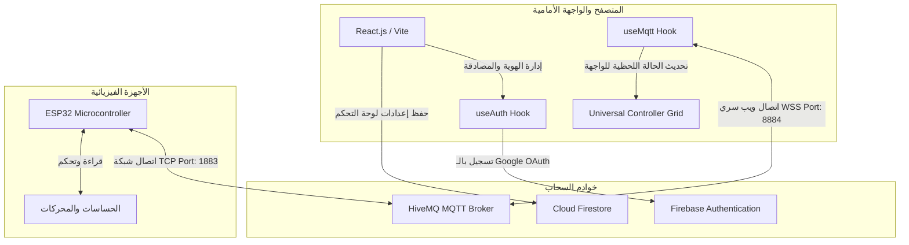

# دليل الفهم الشامل للوحة تحكم إنترنت الأشياء (IoT SaaS Dashboard)

مرحباً بك في الدليل التعريفي الشامل للمشروع. تم تصميم هذا النظام ليكون منصة متكاملة وراقية لإدارة أجهزة إنترنت الأشياء (IoT) والتحكم بها لحظياً (Real-time) باستخدام أحدث تقنيات الويب الحديثة.

---

## 1. الفكرة العامة للمشروع (The Concept)
المشروع عبارة عن **منصة لوحة تحكم سحابية لإنترنت الأشياء (IoT SaaS Dashboard)** تركز على تزويد المطورين والهواة بواجهة تفاعلية فورية للتحكم بأجهزة المايكروكنترولر (مثل **ESP32** أو Arduino) ومراقبتها دون الحاجة لبناء خوادم معقدة.

### الفلسفة الأساسية للنظام:
* **التخلص من تعقيدات قواعد البيانات للأجهزة:** بدلاً من إجبار الجهاز على القراءة والكتابة المباشرة في Firebase (والتي تستهلك طاقة وذاكرة في ESP32)، يتبنى النظام بروتوكول **MQTT** الفائق السرعة كقناة اتصال أساسية.
* **الفصل بين الهوية والبيانات:** تُسستخدم قاعدة بيانات **Firebase Auth & Firestore** لإدارة المستخدمين وحفظ إعدادات لوحات التحكم الخاصة بهم فقط (مثل أماكن وحجم الأزرار والمؤشرات)، بينما تمر بيانات الأجهزة الحساسة والتحكم اللحظي عبر وسيط MQTT مجاني وسريع (`broker.hivemq.com`).
* **التخصيص الكامل:** يستطيع المستخدم إنشاء "مساحات عمل" (Workspaces) متعددة وتخصيص لوحة تحكم فريدة لكل غرفة أو جهاز، مع واجهة سحب وإفلات (Drag and Drop) وتغيير الأحجام لحظياً لتناسب احتياجاته.

---

## 2. البنية الهندسية وتدفق البيانات (System Architecture & Data Flow)

يعمل المشروع وفق معمارية ثلاثية الأطراف متناغمة:

### كيف تتدفق البيانات؟
1. **تسجيل الدخول:** يقوم المستخدم بتسجيل الدخول بأمان عبر حساب Google. يقوم `useAuth` بالتحقق من الهوية وحفظ معلومات الحساب الأساسية في Firestore.
2. **تحميل الواجهة:** تقوم المنصة بجلب مساحات العمل والأدوات المحفوظة مسبقاً لهذا المستخدم من Firestore.
3. **الاتصال بالوسيط (MQTT Broker):** بمجرد دخول المستخدم، يقوم الـ Hook المخصص `useMqtt` بفتح اتصال مشفر (WebSockets Secure) مع سيرفر HiveMQ على المنفذ **8884**، ويشترك تلقائياً في جميع المواضيع (Topics) الخاصة بـ UID المستخدم الفريد:
   `[USER_UID]/#`
4. **إرسال واستقبل البيانات:**
   * **من الـ ESP32 إلى الموقع:** يقرأ الـ ESP32 مستشعر الحرارة ويرسله إلى موضوع مثل `[UID]/sensor/temperature`. يستقبل الموقع الرسالة فوراً ويحدث مؤشر الحرارة في أجزاء من الثانية.
   * **من الموقع إلى الـ ESP32:** عند النقر على زر المصباح في الموقع، ينشر الموقع رسالة `ON` على الموضوع `[UID]/actuator/led`. يستقبل الـ ESP32 الأمر فوراً ويقوم بتشغيل الضوء.

---

## 3. التصميم البصري والجماليات الفاخرة (Design Aesthetics)

تم تصميم الواجهة بمظهر تقني مذهل (Ultra-Premium Tech Style) يحاكي لوحات تحكم السيارات المستقبلية وغرف العمليات المتقدمة:

* **خلفية جزيئات الـ WebGL التفاعلية (`CanvasRevealBackground.jsx`):**
  خلفية حية ومتحركة تم بناؤها باستخدام **Three.js** و **React Three Fiber**. تعتمد على كود برمجيات التظليل المخصصة (Custom Fragment Shaders) لرسم مصفوفة من النقاط المضيئة (Dot Matrix) التي تنبض وتتلاشى وتتفاعل بحسابات رياضية دقيقة مع طبقة تعتيم دائرية (Vignette) لمنع تشتيت المستخدم والحفاظ على سهولة القراءة.
* **النموذج ثلاثي الأبعاد للجهاز (`ESP32Model.jsx`):**
  بدلاً من عرض صورة ثابتة، يحتوي الموقع على لوحة دارة مطبوعة ثلاثية الأبعاد (3D PCB) كاملة لجهاز ESP32 تم تصميمها برمجياً بالكامل بـ HTML/CSS وحركات **Framer Motion**. يمكن للمستخدم سحبها وتدويرها في مساحة ثلاثية الأبعاد لرؤية المكونات مثل هوائي الواي فاي الذهبي، شريحة الاتصال المعدنية، أزرار التمهيد (Boot)، والمنافذ.
* **أزرار النيون الفاخرة (`neon-button.tsx`):**
  أزرار مبنية باستخدام `class-variance-authority` وتأثيرات النيون المتوهجة. عند تمرير الماوس فوق الأزرار النشطة، يظهر خط متوهج أنيق باللون الأزرق النيون في الأعلى والأسفل يمنح شعوراً بالحيوية والتفاعل الفوري (Micro-animations).

---

## 4. تحليل تفصيلي للمكونات وأكوادها (Detailed Code Analysis)

### أ. ملف التنسيق الرئيسي وإدارة الصفحات: `App.jsx`
هو العقل المدبر للواجهة. يقوم بـ:
1. مراقبة حالة المستخدم عبر `useAuth`؛ إذا لم يكن مسجلاً، يعرض صفحة الدخول `AuthPage`.
2. يجلب مساحات العمل الخاصة بالمستخدم ديناميكياً من Firestore. وإذا لم تكن موجودة، يقوم بتحميل مساحات العمل الافتراضية من الذاكرة المحلية (LocalStorage).
3. يتيح للمستخدم إضافة مساحة عمل جديدة وربطها بـ ESP32 مخصص (`esp32Prefix`).
4. ينسق توزيع الشاشة (Sidebar في اليسار، Header في الأعلى، لوحة التحكم الرئيسية `UniversalController` في المنتصف، ونافذة الأوامر الحية `LiveTerminal` بالأسفل).

### ب. المتحكم العالمي التفاعلي: `UniversalController.jsx`
هذا هو أهم مكون تفاعلي في النظام. يعتمد على مكتبة `react-grid-layout` التي تتيح سحب وإفلات وتعديل حجم الأدوات بحرية.

**أهم أنواع الأدوات المدعومة:**
1. **حساسات (Sensors):**
   * **أداة الـ Gauge:** تعرض قيمة رقمية تفاعلية تتغير ألوانها بناءً على الخطر (أزرق للبارد، برتقالي للمتوسط، أحمر للحار) مع رسم بياني مصغر (Sparkline/LineChart) يعرض تاريخ تغير القراءة لحظياً من خلال حفظ آخر 35 عينة في الذاكرة.
2. **محركات ومفاتيح (Actuators):**
   * **LED Switch:** زر دائري متوهج يرسل `ON` أو `OFF` عند النقر عليه لتشغيل أو إطفاء الأجهزة.
   * **Servo Slider:** شريط تمرير لإرسال زوايا الحركة (من 0 إلى 180 درجة) لمحركات السيرفو.
3. **التحكم بالروبوتات والسيارات اللاسلكية (Robotics):**
   * **D-Pad (لوحة التوجيه الرقمية):** أزرار توجيه (للأمام، للخلف، لليمين، لليسار، وإيقاف) تتوهج وتطلق الأوامر مباشرة طالما أن المستخدم ضاغط على الزر، وترسل تلقائياً `STOP` بمجرد إفلات الزر.
   * **Joystick (عصا التحكم التناظرية):** عصا تحكم دائرية ذكية ومطورة تدعم اللمس السريع وحساب الزوايا الرياضية بـ `Math.atan2` و `Math.hypot` لتحديد الاتجاه ونشر الأمر فورياً عبر موضوع MQTT واحد.
   * **Speed Slider:** لتغيير سرعة المحركات من (0 إلى 255).

### ج. محرك اتصالات الـ MQTT: `useMqtt.js`
يستخدم مكتبة `mqtt` لإجراء اتصال WebSockets ثنائي الاتجاه بالخادم:
* **اشتراك تلقائي:** بمجرد نجاح الاتصال، يشترك بالمسار الخاص بالمستخدم: `[userUID]/#`.
* **معالجة الرسائل القادمة:** عند وصول رسالة جديدة، يقوم الـ Hook بفصل الـ Topic الفرعي، وتحديث حالة الأجهزة `deviceStates` مع تسجيل وقت آخر ظهور للجهاز `lastSeen` وتخزين الرسالة في مصفوفة السجل لعرضها بالـ Terminal السفلي.
* **النشر التفاؤلي (Optimistic Update):** عند إرسال أمر، يتم تحديث حالة الواجهة محلياً فوراً لجعل الاستجابة تبدو فورية للمستخدم دون انتظار رد السيرفر.

### د. أمن المستخدم: `useAuth.js`
* يعتمد على **Firebase Authentication** لتوفير تسجيل دخول آمن بالبريد الإلكتروني أو حساب Google.
* يوفر نظاماً كاملاً للتحقق من البريد الإلكتروني (Email Verification) وإعادة إرسال الرابط في حال عدم التفعيل لضمان أمان اللوحات.
* يجلب بقية تفاصيل الملف الشخصي (Profile) في الخلفية لضمان سرعة تحميل أوليّة فائقة للواجهة.

### هـ. دليل المطورين الذكي: `DeveloperGuide.jsx`
هذا هو الجسر بين السحاب والأجهزة الفيزيائية. يعرض كود C++ جاهزاً للنسخ متوافقاً مع المنصة، ومقسماً إلى ثلاثة سيناريوهات رئيسية:
1. **التحكم بمصباح (LED Control):** يوضح كيفية قراءة رسائل `ON/OFF` والتحكم بمنفذ GPIO في ESP32.
2. **قراءة الحساسات (Temperature):** يوضح كيفية قراءة حساس DHT22 ونشر الحرارة إلى موضوع العميل.
3. **السيارة اللاسلكية (RC Car):** كود متكامل للتحكم بأربعة محركات بناءً على أوامر التوجيه المرسلة من أزرار الـ D-Pad أو عصا التحكم بالموقع.

---

## 5. الخلاصة البرمجية وتكامل الأدوار

المشروع يمثل تحفة برمجية تجمع بين **التصميم البصري عالي الجودة (Aesthetics)** و **الأداء المتزامن فائق السرعة (Real-time Efficiency)**. بفضل تصميمه المعياري (Component-Based Design) وتوظيفه لـ React Hooks المخصصة، يقدم النظام كفاءة تشغيلية ممتازة ومرونة تامة للتوسع مستقبلاً لإضافة المزيد من الحساسات أو طرق التحكم.
